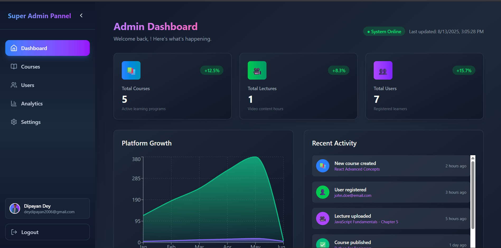
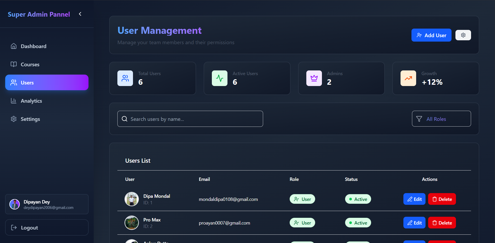

# 🎓 Curiox – E-Learning Platform


Curiox is a modern MERN-based e-learning platform designed for Students, Instructors, and a Super Admin.  
It offers role-based features, secure payments via Razorpay (test mode), and an intuitive interface for creating, managing, and purchasing courses.

---

## 📸 Screenshots
## 🖼 Interface Previews

| **Student Panel** | **Instructor Panel** | **Super Admin Panel** | **Super Admin Panel** | **Super Admin Panel** |
|-------------------|----------------------|-------------------|-------------------|-------------------|
|  |  |  |  |  |


## 🔑 Roles & Features

### **1. Super Admin**
> Super Admin is created manually in the database by the developer.  
> Has full access to the system.

- ✅ Create and manage Instructors
- ✅ Delete Instructors
- ✅ View all courses, lectures, and students
- ✅ Remove any course or lecture
- ✅ Manage all user accounts

---

### **2. Instructor**
- ✅ Create courses with title, description, thumbnail, and price
- ✅ Add lectures (video uploads) to their own courses
- ✅ Delete their own lectures
- ✅ Edit course details
- ❌ Cannot access other instructors’ courses

---

### **3. Student**
- ✅ Browse all available courses
- ✅ View course details
- ✅ Purchase courses via Razorpay (test mode)
- ✅ Access purchased courses & lectures
- ✅ Watch video lectures after purchase

---

## 💳 Payment Integration

- **Razorpay (Test Mode)**
- Secure checkout for purchasing courses
- Only test credentials are used for transactions during development

---

## 🛠 Tech Stack

**Frontend**
- React.js
- Tailwind CSS
- Axios
- React Router DOM
- SweetAlert2 / Toastify for alerts

**Backend**
- Node.js
- Express.js
- MongoDB (Mongoose)
- Cloudinary (for storing videos & images)
- Multer (file uploads)
- Razorpay SDK

---

## 📂 Project Structure

Curiox/
│
├── client/ # React Frontend
│ ├── src/
│ │ ├── components/
│ │ ├── pages/
│ │ ├── Context/
│ │ ├── utils/
│ │ └── App.js
│ └── package.json
│
├── server/ # Express Backend
│ ├── config/ # DB, Cloudinary, Razorpay configs
│ ├── controllers/ # Business logic
│ ├── models/ # Mongoose schemas
│ ├── routes/ # API routes
│ ├── middleware/ # Auth & error handling
│ └── server.js
│
└── README.md


---

## 🚀 Installation & Setup

### 1️⃣ Clone the repository

<!-- ```bash -->
git clone https://github.com/Dipayan-Dey/Curiox-educational-platform
cd curiox

# Install server dependencies
cd server
npm install

# Install client dependencies
cd ../client
npm install

### 3️⃣ Environment Variables
  
Create .env files in both server and client folders.

Server .env

ini
Copy
Edit
PORT=8000
MONGO_URI=your_mongo_connection_string
JWT_SECRET=your_jwt_secret
CLOUDINARY_CLOUD_NAME=your_cloud_name
CLOUDINARY_API_KEY=your_api_key
CLOUDINARY_API_SECRET=your_api_secret
RAZORPAY_KEY_ID=your_razorpay_key_id
RAZORPAY_KEY_SECRET=your_razorpay_secret
Client .env

ini
Copy
Edit
REACT_APP_SERVER_URL=http://localhost:8000
REACT_APP_RAZORPAY_KEY=your_razorpay_key_id
4️⃣ Run the project
bash
Copy
Edit
# Start backend
cd server
npm run dev

# Start frontend
cd ../client
npm start
🧪 Test Mode Payments
Test Card Number: 4111 1111 1111 1111

Expiry: Any future date

CVV: Any 3 digits

OTP: 123456

📌 Notes
Super Admin must be created manually in MongoDB.

All uploads (course thumbnails & lecture videos) are stored on Cloudinary.

Only Instructors can manage their own courses.

Razorpay integration is currently in test mode.

📜 License
This project is licensed under the MIT License.

💡 Author
Dipayan Dey
Made with ❤️ using MERN Stack

yaml
Copy
Edit

---

If you want, I can also **add real placeholder images** (`banner.png`, `student-panel.png`, etc.) so your README looks professional right away when you push it to GitHub.  
Would you like me to prepare those image placeholders too?